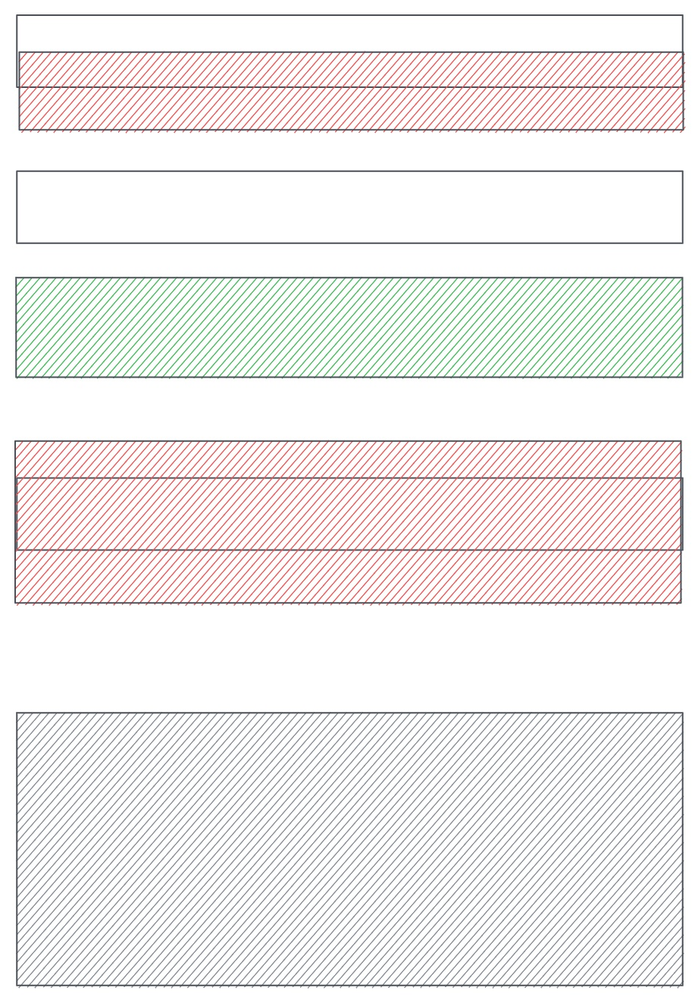
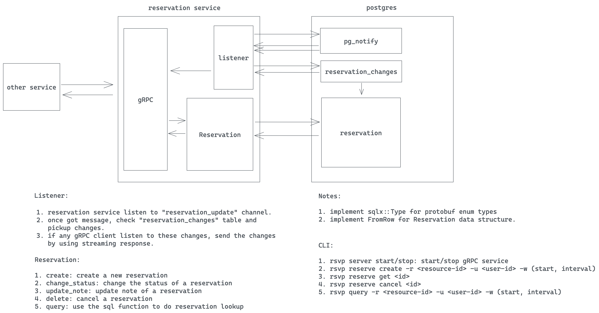

## Feature

- Feature Name: core-reservation
- Start Date: 2025-05-25

## Summary

解决在一段时间内保留资源问题的核心预订服务。
我们利用postgres EXCLUDE约束来确保在给定的时间只能为给定的资源做一个预留。

## Motivation

我们需要一个通用的解决方案来满足不同的预订需求：
1. 日历预订；
2. 酒店/客房预订；
3. 会议室预订；
4. 停车场预订；
5. 等。
为这些需求反复构建特性是对时间和资源的浪费。
我们应该有一个所有团队都可以使用的通用解决方案。

## Guide-level explanation

基本架构


### Service interface

我们将使用gRPC作为服务接口。下面是原型定义：

```proto
enum ReservationStatus {
    UNKNOWN = 0;
    PENDING = 1;
    CONFIRMED = 2;
    BLOCKED = 3;
}

enum ReservationUpdateType {
    UNKNOWN = 0;
    CREATE = 1;
    UPDATE = 2;
    DELETE = 3;
}

message Reservation {
    string id = 1;
    string user_id = 2;
    ReservationStatus status = 3;

    // resource reservation window
    string resource_id = 4;
    google.protobuf.Timestamp start = 5;
    google.protobuf.Timestamp end = 6;

    // extra note
    string note = 7;
}

message ReserveRequest {
    Reservation reservation = 1;
}

message ReserveResponse {
    Reservation reservation = 1;
}

message UpdateRequest {
    string note = 2;
}

message UpdateResponse {
    Reservation reservation = 1;
}

message ConfirmRequest {
    string id = 1;
}

message ConfirmResponse {
    Reservation reservation = 1;
}

message CancelRequest {
    string id = 1;
}

message CancelResponse {
    Reservation reservation = 1;
}

message GetRequest {
    string id = 1;
}

message GetResponse {
    Reservation reservation = 1;
}

message QueryRequest {
    string resource_id = 1;
    string user_id = 2;
    // use status to filter result. If UNKNOWN, return all reservations
    ReservationStatus status = 3;
    google.protobuf.Timestamp start = 4;
    google.protobuf.Timestamp end = 5;
}

message ListenRequest {}
message ListenResponse {
    int8 op = 1;
    Reservation reservation = 2;
}

service ReservationService {
    rpc reserve(ReserveRequest) returns (ReserveResponse);
    rpc confirm(ConfirmRequest) returns (ConfirmResponse);
    rpc update(UpdateRequest) returns (UpdateResponse);
    rpc cancel(CancelRequest) returns (CancelResponse);
    rpc get(GetRequest) returns (GetResponse);
    rpc query(QueryRequest) returns (stream Reservation);
    // another system could monitor newly added/confirmed/cancelled reservations
    rpc listen(ListenRequest) returns (stream Reservation);
}
```

### Database schema

We use postgres as the database. Below is the schema:

```sql
CREATE SCHEMA rsvp;
CREATE TYPE rsvp.reservation_status AS ENUM ('unknown', 'pending', 'confirmed', 'blocked');
CREATE TYPE rsvp.reservation_update_type AS ENUM ('unknown', 'create', 'update', 'delete');

CREATE TABLE rsvp.reservations (
    id uuid NOT NULL DEFAULT uuid_generate_v4(),
    user_id VARCHAR(64) NOT NULL,
    status rsvp.reservation_status NOT NULL DEFAULT 'pending',

    resource_id VARCHAR(64) NOT NULL,
    timespan TSTZRANGE NOT NULL,

    note TEXT,

    CONSTRAINT reservations_pkey PRIMARY KEY (id),
    CONSTRAINT reservations_conflict EXCLUDE USING gist (resource_id WITH =, timespan WITH &&)
);
CREATE INDEX reservations_resource_id_idx ON rsvp.reservations (resource_id);
CREATE INDEX reservations_user_id_idx ON rsvp.reservations (user_id);

-- if user_id is null, find all reservations within during for the resource
-- if resource_id is null, find all reservations within during for the user
-- if both are null, find all reservations within during
-- if both set, find all reservations within during for the resource and user
CREATE OR REPLACE FUNCTION rsvp.query(uid text, rid text, during: TSTZRANGE) RETURNS TABLE rsvp.reservations AS $$ $$ LANGUAGE plpgsql;

-- resevation change queue
CREATE TABLE rsvp.reservation_changes (
    id SERIAL NOT NULL,
    reservation_id uuid NOT NULL,
    op rsvp.reservation_update_type NOT NULL,
);

-- trigger for add/update/delete a reservation
CREATE OR REPLACE FUNCTION rsvp.reservations_trigger() RETURNS TRIGGER AS $$
BEGIN
    IF TG_OP = 'INSERT' THEN
        -- update reservation_changes
        INSERT INTO rsvp.reservation_changes (reservation_id, op) VALUES (NEW.id, 'create');
    ELSIF TG_OP = 'UPDATE' THEN
        -- if status changed, update reservation_changes
        IF OLD.status <> NEW.status THEN
            INSERT INTO rsvp.reservation_changes (reservation_id, op) VALUES (NEW.id, 'update');
        END IF;
    ELSIF TG_OP = 'DELETE' THEN
        -- update reservation_changes
        INSERT INTO rsvp.reservation_changes (reservation_id, op) VALUES (OLD.id, 'delete');
    END IF;
    -- notify a channel called reservation_update
    NOTIFY reservation_update;
    RETURN NULL;
END;
$$ LANGUAGE plpgsql;

CREATE TRIGGER reservations_trigger
    AFTER INSERT OR UPDATE OR DELETE ON rsvp.reservations
    FOR EACH ROW EXECUTE PROCEDURE rsvp.reservations_trigger();
```

Here we use EXCLUDE constraint provided by postgres to ensure that on overlapping reservations cannot be made for a given resource at a given time.

```sql
CONSTRAINT reservations_conflict EXCLUDE USING gist (resource_id WITH =, timespan WITH &&)
```



We also use a trigger to notify a channel when a reservation is added/updated/deleted. To make sure even we missed certain messages from the channel when DB connection is down for some reason, we use a queue to store reservation changes. Thus when we receive a notification, we can query the queue to get all the changes since last time we checked, and once we finished processing all the changes, we can delete them from the queue.

### Core flow



## Reference-level explanation

TBD

## Drawbacks

N/A

## Rationale and alternatives

N/A

## Prior art

N/A

## Unresolved questions

- how to handle repeated reservation? - is this more ore less a business logic which shouldn't be put into this layer? (non-goal: we consider this is a business logic and should be handled by the caller)
- if load is big, we may use an external queue for recording changes.
- we haven't considered tracking/observability/deployment yet.
- query performance might be an issue - need to revisit the index and also consider using cache.

## Future possibilities

TBD